# Rock, Paper, Scissors, Lizard, Rock

[View the live project here](https://hen0678.github.io/Rock-Paper-Scissors-Lizard-Spock/index.html)

## Overview
This Rock, Paper, Scissors, Lizard, Spock game is a twist on the classic Rock, Paper, Scissors. First seen in the Big Bang Theory. Users can choose one of five options and the computer will randomly generate an option. The player's choice can beat two of the other options, lost to two and draw with one. To make the game more interesting a scoreboard will keep track of the score and when ready the scores can be reset. 

The game includes a link to an instructions page and a computer game theme background has been added along with some retro CSS styling. 

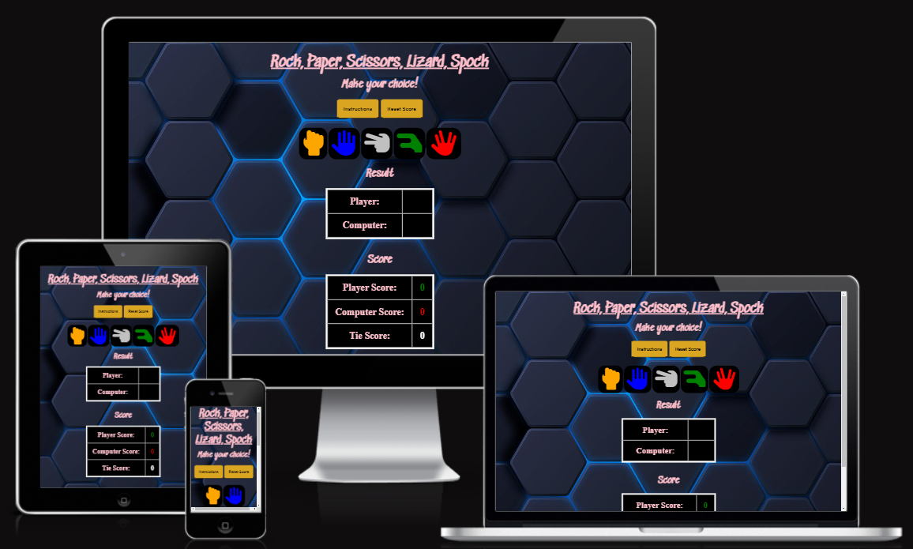

## User Experience (UX) 

### First Time Visitors
As a user of this site, I want to: 

* Easily understand the main purpose of the game.
* Want to play a game which is quick and easy.
* Have a way to refer to the instructions. 
* I want a game that is visually appealing and fun.
* I want to be able to easily track score.
* I want to be able to reset the score at any time.

### Returning Visitors
* As a returning visitor I want to be able to be able to enjoy the same game.

### Frequent user
* I want to see if I can continue to post personal best scores.

## Features

### Main page 

* From the home page you can go straight into playing the game. Alternatively, you can go to the instructions page and from the instructions page you can head straight back to the game page. At any stage, the score can be reset so you are not forced to play a best of three, best of five etc. The number of games the user plays is entirely up to them.

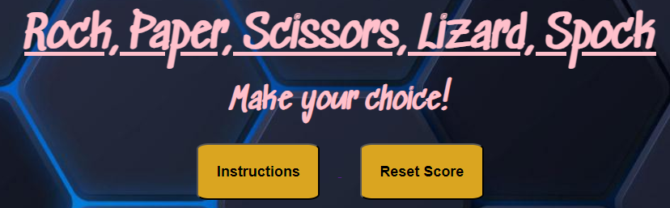

* The choice icons are all hand symbols each with a distinct colour. The image background provides a retro looking computer game feel, and the text is a funky pink colour as this game should be fun to play.

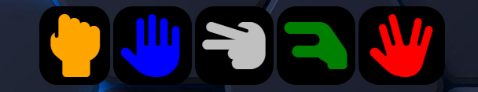

* When the player makes a choice, the computer will also make a random choice and the result will be displayed. 

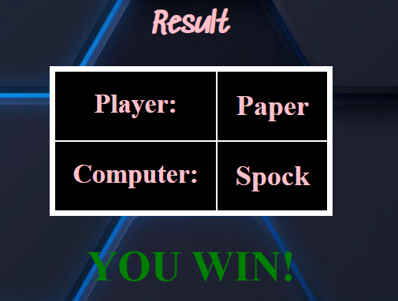

* There is a game scoreboard which will track games won, lost, and tied.

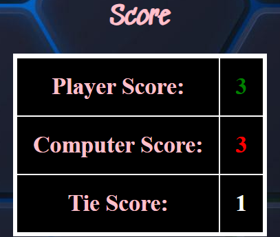

* The instructions page allows users to understand 'what choice beats what other choices' when playing the game.

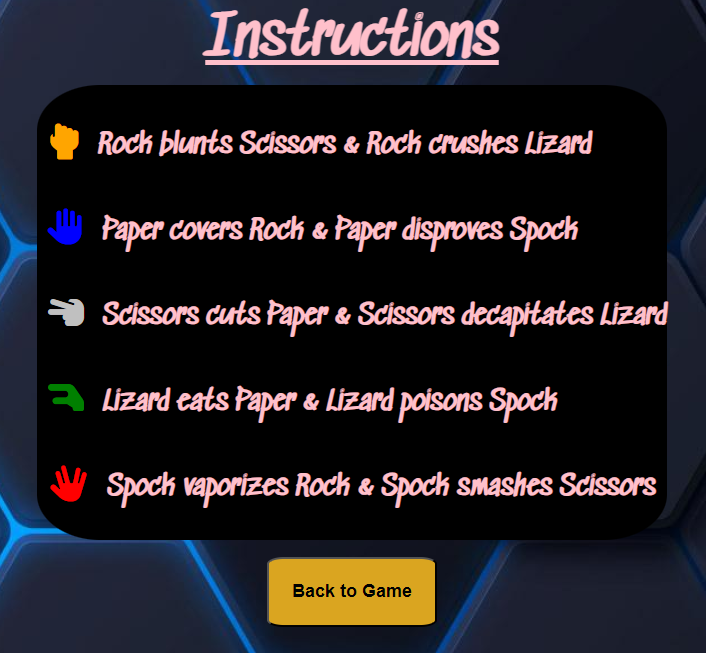

### Additional features to include 
The list of additional features to be added later include:

* Options to play a set number of games.
* For icons rather than text to show under the Results section

## Technologies used
The following technologies were used for this site:
* HTML5
* CSS3
* W3C validation for HTML and CSS
* JSHint validation for Javascript 
* [Google Fonts](https://hen0678.github.io/Rock-Paper-Scissors-Lizard-Spock/index.html) - used to import the 'Sedgwick Ave' font into the style.css file.
* [Flaticon](https://www.flaticon.com/free-icons/rock-paper-scissors) - used for the Favicon icons.  
* [Favicon.zip](https://favicon.zip/?ref=producthunt) - used to generate the Favicon icons.
* [Fontawesome](https://fontawesome.com) - used for the game choice icons.
* [Freepik](http://www.freepik.com) - used for the background image.
* [Am I responsive?](https://ui.dev/amiresponsive?url=https://hen0678.github.io/Rock-Paper-Scissors-Lizard-Spock/) - used for checking the look on different size devices.
* GitPod was used for coding the site and version control.
* GitHub as the repository for the projects code.
* Lighthouse in Chrome dev tools for accessibility testing.

## Testing

###
|Features|Test Conducted|Expected Outcome|Test Outcome|
|:----|:----|:----|:----|
|Game playability on laptop|Playing the game on a laptop selecting all choice options|All choice options to be displayed and the right outcome produced|Pass|
|Game playability on mobile|Playing the game on a mobile device selecting all choice options|All choice options to be displayed and the right outcome produced|Pass|
|Scoreboard|Checked that this functioned correctly on laptop and mobile|The scores to be incremented after each selection is made|Pass|
|Reset button|Checked this resets the scores on both laptop and mobile|All scores to be reset to 0|Pass|
|Instructions page|Checked this displayed on both laptop and mobile|Instructions page to open and look good|Pass|

### Browser Compatibility
|Browser Tested|Intended Appearance|Test Outcome|
|:----|:----|:----|
|Google Chrome|Good|Pass|
|Firefox|Good|Pass|
|Edge|Good|Pass|
|Safari|Good|Pass|

#### Chrome test output
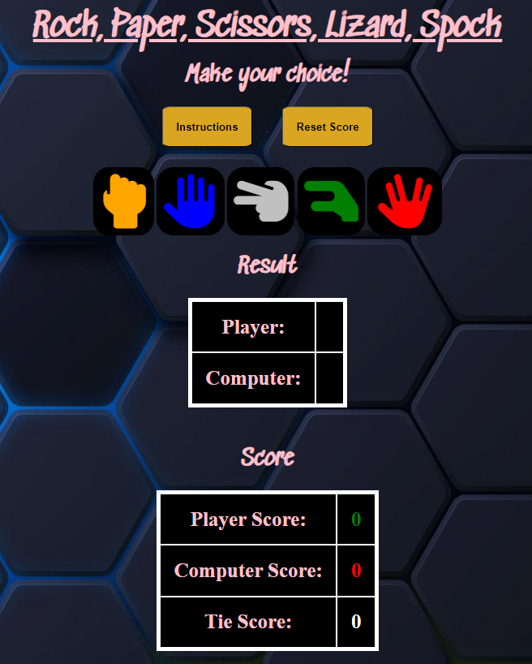
#### Firefox test output
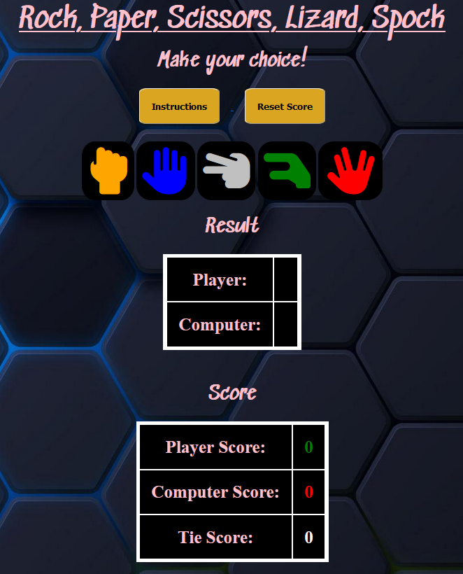
#### Edge test output
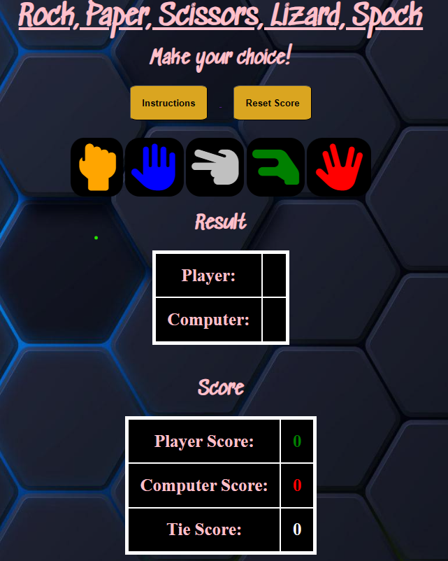
#### Safari test output
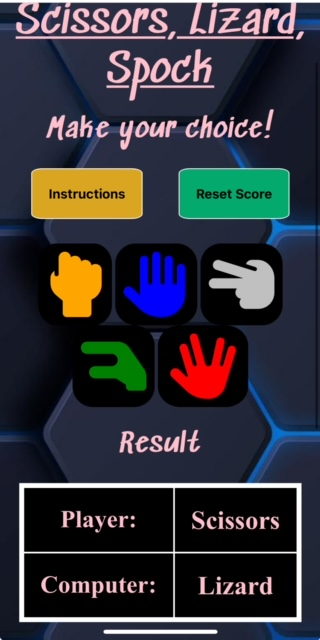

### Responsiveness Testing
|Device Tested|Site Responsive >320px - <699px|Site Responsive >=700px|Test Outcome|
|:----|:----|:----|:----|
|I-phone 13|Yes|N/A|Pass|
|I-phone 5|Yes|N/A|Pass|
|I-Pad Mini|N/A|Yes|Pass|
|Laptop|N/A|Yes|Pass|
|Desktop|N/A|Yes|Pass|

### Code validation
|Page Tested|Screenshot of Errors|Solution Applied|Screenshot of Clear Validator Output|Test Outcome|
|:----|:----|:----|:----|:----|
|Home-HTML|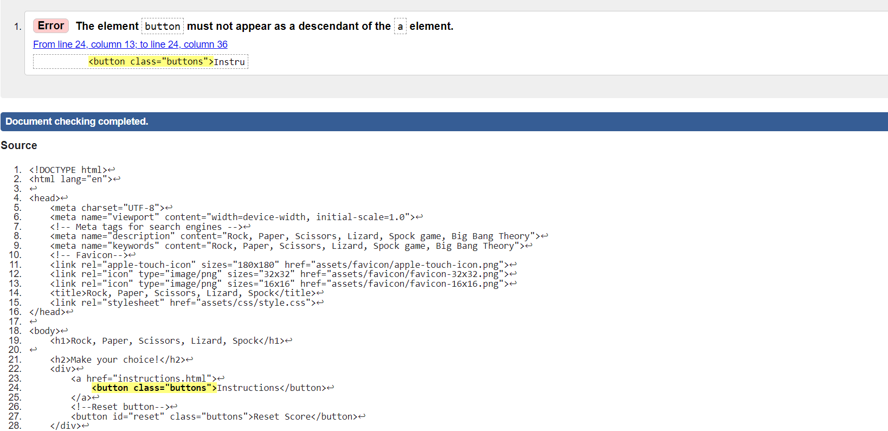|Removed anchor element in index.html and replace with onclick|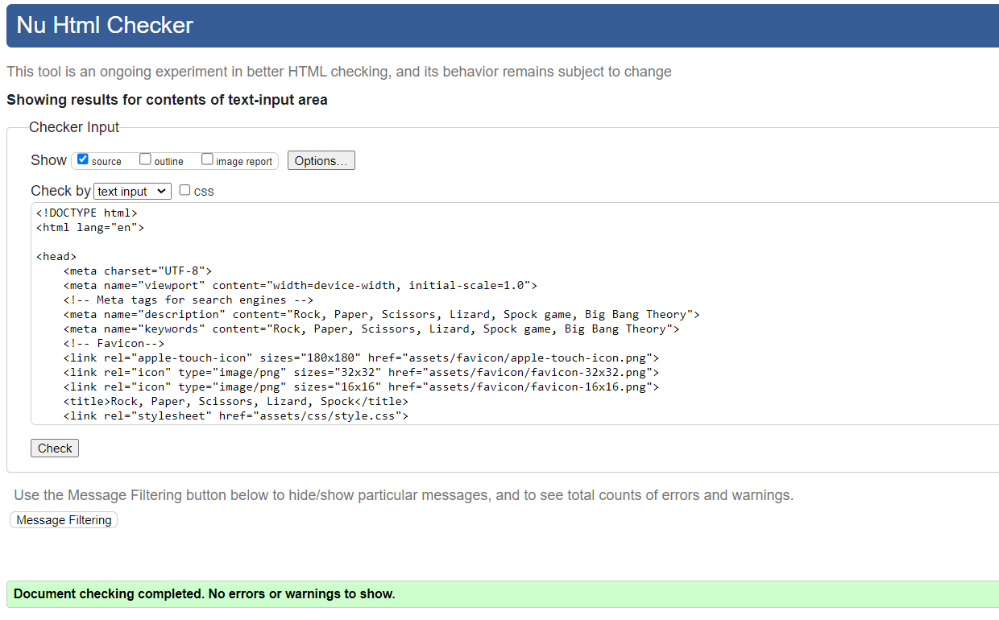|Pass|
|Instructions-HTML|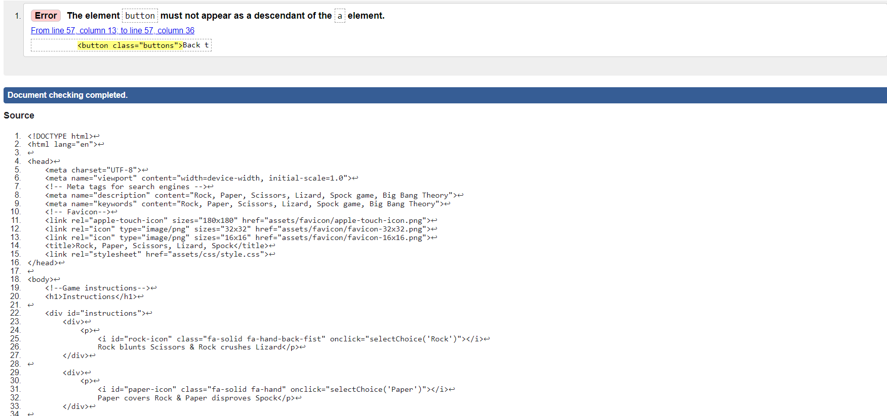|Removed anchor element in instructions.html and replace with onclick|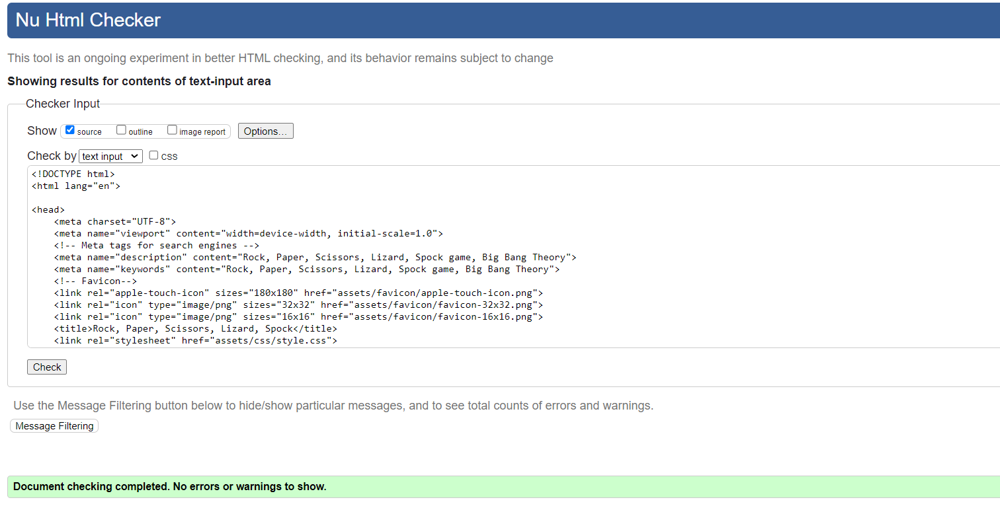|Pass|
|CSS|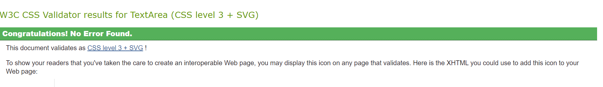|N/A|N/A|Pass|
|Javascript|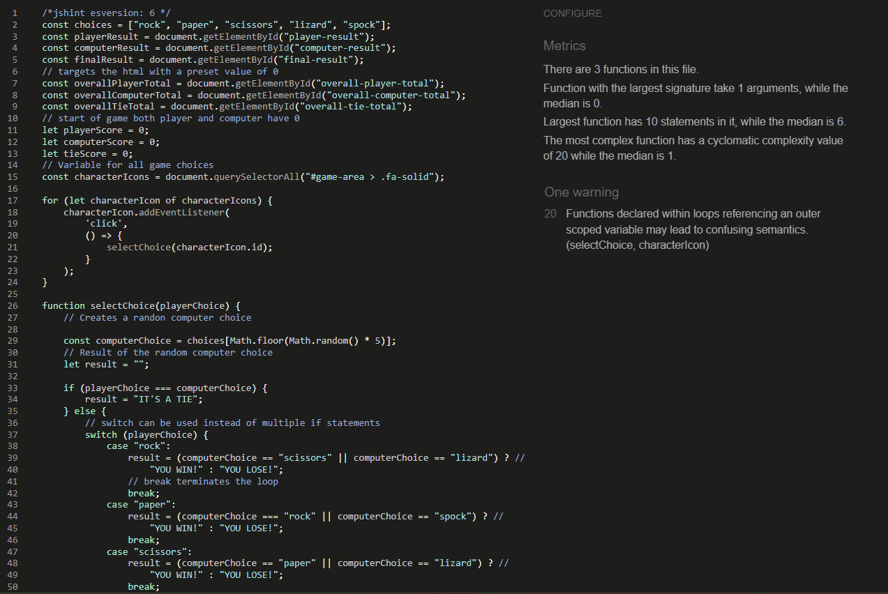|One warning but will keep the code as is|N/A|Pass|

### Bugs
|Bug|Description|Solution applied|Result|
|:----|:----|:----|:----|
|Results table not displaying correctly|The results table shows the score below the player / computer and not to the right|Additional Div element required |Now displaying correctly|

### Lighthouse Testing
|View Tested|Outcome of the audit|Solution applied|Screenshot of clear Validator output|
|:----|:----|:----|:----|
|390 x 844|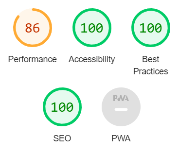|N/A|N/A|
|I-Phone 5|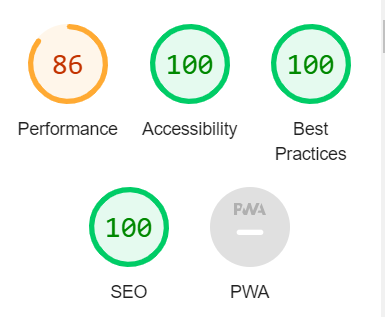|N/A|N/A|
|I-Pad Mini|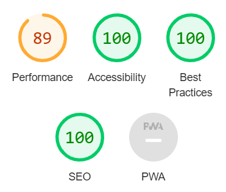|N/A|N/A|
|Laptop 1440px|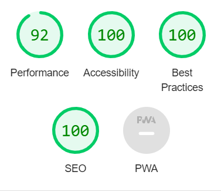|N/A|N/A|
|4k 2560px|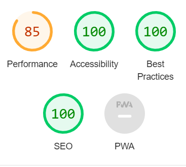|N/A|N/A|

## Deployment 
### Deploying the site
After creating the website in GitPod, the site was deployed to GitHub to host. To deploy the project, use the following steps:
* In the GitHub repository, navigate to the Settings tab at the top of the page.
* Select Pages on the left hand side of the page
* Under "Build and deployment" there is a Source dropdown. Select Deploy from a branch and then Save.
* Once the main branch has been selected and saved, the page will be automatically refreshed with a detailed ribbon display to indicate the successful deployment.
* The live link to the site can be found here - https://hen0678.github.io/Rock-Paper-Scissors-Lizard-Spock/

### Cloning the site

* Go to https://github.com/Hen0678/Rock-Paper-Scissors-Lizard-Spock. 
* Click the Code button. 
* Select Copy URL to Clipboard.
* Open a GitBash terminal and navigate to the directory where you want to locate the clone.
* On the command line, type "git clone" then paste in the copied URL and press the Enter key to begin the clone process.

## Credits

### Code
* Bro Code - used for Javascript inspiration.

### Images
Images have been accumulated form the following sites:
* [Fontawesome](https://fontawesome.com) - used for the game choice icons.
* Background image - "Designed by coolvector / Freepik"

### Other acknowledgments
* Brian Macharia for mentor support and advice.

 

